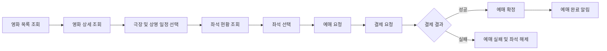

# 온라인 영화 예매 시스템

# 요구사항 분석서(SRS, Software Requirements Specification)

---

## 1. 문서 개요

### 1.1 시스템명

**온라인 영화 예매 시스템**

---

### 1.2 작성 목적

본 문서는 온라인 영화 예매 시스템의 구축을 위해 필요한 요구사항을 체계적으로 정의한다.
특히 향후 **MSA(Microservices Architecture)** 기반 설계로 확장할 수 있도록 다음을 명확히 한다.

* 시스템의 주요 기능 범위
* 고객, 관리자, 외부 시스템의 상호작용
* 기능적 요구사항과 비기능적 요구사항
* 데이터 및 외부 연계 요구사항
* 서비스 분리를 고려한 도메인 후보
* 추후 설계 단계에서 고려해야 할 주요 제약사항

---

### 1.3 분석 범위

본 SRS의 분석 범위는 다음과 같다.

| 범위     | 포함 내용                       |
| ------ | --------------------------- |
| 회원 관리  | 회원가입, 로그인, 인증, 회원 정보        |
| 영화 정보  | 상영 중/예정 영화 조회, 상세 정보        |
| 극장 정보  | 지역별 극장, 상영관, 좌석 구조          |
| 상영 일정  | 영화별·극장별·날짜별 상영 시간           |
| 좌석 관리  | 좌석 조회, 임시 점유, 점유 만료         |
| 예매     | 예매 생성, 예매 확정, 예매 내역         |
| 결제     | 결제 요청, 승인 결과 반영             |
| 취소/환불  | 예매 취소, 환불 요청, 취소 정책         |
| 알림     | 예매 완료, 취소 완료, 결제 결과 알림      |
| 관리자 기능 | 영화, 극장, 상영 일정, 좌석, 운영 현황 관리 |

---

# 2. 비즈니스 목표

온라인 영화 예매 시스템은 다음 목표를 달성해야 한다.

1. 고객이 원하는 영화와 상영 시간을 빠르게 탐색할 수 있어야 한다.
2. 실시간 좌석 현황을 기반으로 중복 예매 없이 안정적인 예약이 가능해야 한다.
3. 결제 처리와 예매 확정 흐름이 일관되고 신뢰성 있게 동작해야 한다.
4. 예매 취소 및 환불 절차가 명확하고 추적 가능해야 한다.
5. 관리자에게 영화, 극장, 상영 일정, 예매 현황을 운영할 수 있는 기능을 제공해야 한다.
6. 향후 사용량 증가와 기능 확장에 대응할 수 있는 구조를 갖추어야 한다.
7. 서비스 장애가 발생하더라도 핵심 거래 데이터의 정합성을 유지해야 한다.

---

# 3. 이해관계자 및 사용자 유형

## 3.1 주요 이해관계자

| 이해관계자      | 관심 사항                       |
| ---------- | --------------------------- |
| 일반 고객      | 빠른 영화 조회, 안정적 좌석 예매, 결제 편의성 |
| 회원 고객      | 예매 내역 관리, 취소/환불, 알림 수신      |
| 비회원 고객     | 비회원 예매 허용 여부에 따른 제한적 이용     |
| 운영 관리자     | 영화/극장/상영 일정 등록 및 예매 현황 관리   |
| 고객지원 담당자   | 예매 오류, 취소/환불 문의 처리          |
| 결제 대행사(PG) | 결제 요청 처리 및 승인 결과 반환         |
| 알림 서비스 제공자 | SMS, 이메일, 앱 푸시 발송           |
| 시스템 운영자    | 장애 대응, 로그 분석, 성능 모니터링       |

---

## 3.2 사용자 유형

| 사용자 유형   | 주요 권한                  |
| -------- | ---------------------- |
| 비로그인 사용자 | 영화 조회, 극장 조회, 상영 일정 조회 |
| 로그인 사용자  | 예매, 결제, 예매 취소, 내역 조회   |
| 관리자      | 콘텐츠·극장·상영 일정·운영 정보 관리  |
| 외부 시스템   | 결제 처리, 알림 발송           |

---

# 4. 핵심 업무 흐름

---

## 4.1 고객 관점 업무 흐름

---

## 4.2 관리자 관점 업무 흐름

---

## 4.3 외부 시스템 관점 업무 흐름

| 외부 시스템       | 연계 내용                         |
| ------------ | ----------------------------- |
| 결제 PG 시스템    | 결제 승인, 실패, 취소, 환불 처리          |
| 알림 시스템       | 예매 완료, 결제 실패, 취소 완료 메시지 발송    |
| 영화 메타데이터 API | 영화 포스터, 줄거리, 장르 등 외부 정보 수집 가능 |
| 인증 연계 서비스    | 소셜 로그인 또는 본인 인증 연계 가능         |

---

# 5. 기능적 요구사항

# Functional Requirements

기능 요구사항은 시스템이 제공해야 할 기능을 정의한다.
각 요구사항은 검증 가능하도록 고유 ID를 부여한다.

---

## 5.1 회원 및 인증 요구사항

| ID          | 요구사항                                             |
| ----------- | ------------------------------------------------ |
| FR-AUTH-001 | 시스템은 사용자가 회원가입을 수행할 수 있어야 한다.                    |
| FR-AUTH-002 | 시스템은 사용자가 이메일 또는 아이디와 비밀번호를 통해 로그인할 수 있어야 한다.    |
| FR-AUTH-003 | 시스템은 로그인 성공 시 사용자 인증 토큰을 발급해야 한다.                |
| FR-AUTH-004 | 시스템은 인증된 사용자만 예매, 결제, 예매 취소 기능을 사용할 수 있도록 해야 한다. |
| FR-AUTH-005 | 시스템은 사용자가 로그아웃할 수 있어야 한다.                        |
| FR-AUTH-006 | 시스템은 사용자의 비밀번호 변경 기능을 제공해야 한다.                   |
| FR-AUTH-007 | 시스템은 관리자 권한과 일반 사용자 권한을 구분해야 한다.                 |
| FR-AUTH-008 | 시스템은 관리자 전용 기능 접근 시 관리자 권한을 검증해야 한다.             |

---

## 5.2 영화 정보 조회 요구사항

| ID         | 요구사항                                                     |
| ---------- | -------------------------------------------------------- |
| FR-MOV-001 | 시스템은 현재 상영 중인 영화 목록을 제공해야 한다.                            |
| FR-MOV-002 | 시스템은 개봉 예정 영화 목록을 제공할 수 있어야 한다.                          |
| FR-MOV-003 | 시스템은 영화 제목, 장르, 관람 등급, 러닝타임, 줄거리, 포스터 등의 상세 정보를 제공해야 한다. |
| FR-MOV-004 | 시스템은 영화 제목 또는 장르 기준 검색 기능을 제공해야 한다.                      |
| FR-MOV-005 | 시스템은 영화별 예매 가능한 상영 일정을 조회할 수 있어야 한다.                     |
| FR-MOV-006 | 시스템은 관리자가 영화 정보를 등록, 수정, 비활성화할 수 있어야 한다.                 |

---

## 5.3 극장 및 상영 일정 조회 요구사항

| ID         | 요구사항                                          |
| ---------- | --------------------------------------------- |
| FR-SCH-001 | 시스템은 지역별 극장 목록을 조회할 수 있어야 한다.                 |
| FR-SCH-002 | 시스템은 특정 극장의 상영관 정보를 조회할 수 있어야 한다.             |
| FR-SCH-003 | 시스템은 특정 영화에 대한 날짜별 상영 일정을 제공해야 한다.            |
| FR-SCH-004 | 시스템은 특정 극장에서 상영 중인 영화와 상영 시간을 조회할 수 있어야 한다.   |
| FR-SCH-005 | 시스템은 사용자가 선택한 날짜 기준으로 유효한 상영 일정만 제공해야 한다.     |
| FR-SCH-006 | 시스템은 관리자가 극장, 상영관, 상영 일정을 등록·수정·삭제할 수 있어야 한다. |
| FR-SCH-007 | 시스템은 이미 시작된 상영 회차에 대해서는 신규 예매를 허용하지 않아야 한다.   |

---

## 5.4 좌석 조회 및 선택 요구사항

| ID          | 요구사항                                                         |
| ----------- | ------------------------------------------------------------ |
| FR-SEAT-001 | 시스템은 특정 상영 회차의 전체 좌석 배치와 좌석 상태를 조회할 수 있어야 한다.                |
| FR-SEAT-002 | 시스템은 좌석 상태를 최소한 `예매 가능`, `임시 점유`, `판매 완료`, `사용 불가`로 구분해야 한다. |
| FR-SEAT-003 | 시스템은 사용자가 하나 이상의 좌석을 선택할 수 있어야 한다.                           |
| FR-SEAT-004 | 시스템은 이미 판매 완료된 좌석을 선택하지 못하도록 해야 한다.                          |
| FR-SEAT-005 | 시스템은 사용자가 선택한 좌석을 결제 완료 전까지 일정 시간 임시 점유할 수 있어야 한다.           |
| FR-SEAT-006 | 시스템은 임시 점유 시간이 만료되면 해당 좌석을 자동 해제해야 한다.                       |
| FR-SEAT-007 | 시스템은 동일 좌석에 대해 중복 점유 요청이 발생할 경우 하나의 요청만 성공 처리해야 한다.          |
| FR-SEAT-008 | 시스템은 예매 확정 시 임시 점유 좌석을 판매 완료 상태로 변경해야 한다.                    |
| FR-SEAT-009 | 시스템은 결제 실패 또는 예매 실패 시 임시 점유 좌석을 해제해야 한다.                     |

---

## 5.5 예매 생성 요구사항

| ID         | 요구사항                                                           |
| ---------- | -------------------------------------------------------------- |
| FR-RES-001 | 시스템은 사용자가 선택한 영화, 상영 회차, 좌석을 기준으로 예매 요청을 생성할 수 있어야 한다.         |
| FR-RES-002 | 시스템은 예매 요청 시 좌석 점유 상태가 유효한지 검증해야 한다.                           |
| FR-RES-003 | 시스템은 결제 완료 전 예매 상태를 `결제 대기` 상태로 관리해야 한다.                       |
| FR-RES-004 | 시스템은 결제 성공 시 예매 상태를 `예매 확정`으로 변경해야 한다.                         |
| FR-RES-005 | 시스템은 결제 실패 시 예매 상태를 `예매 실패` 또는 `만료`로 변경해야 한다.                  |
| FR-RES-006 | 시스템은 사용자가 자신의 예매 내역을 조회할 수 있어야 한다.                             |
| FR-RES-007 | 시스템은 예매 내역에서 영화명, 극장, 상영관, 일시, 좌석, 결제 금액, 예매 상태를 확인할 수 있어야 한다. |
| FR-RES-008 | 시스템은 예매 확정 이후 고유 예매 번호를 발급해야 한다.                               |
| FR-RES-009 | 시스템은 동일 결제 요청으로 중복 예매가 생성되지 않도록 해야 한다.                         |

---

## 5.6 결제 요구사항

| ID         | 요구사항                                             |
| ---------- | ------------------------------------------------ |
| FR-PAY-001 | 시스템은 예매 건에 대해 결제 요청을 생성해야 한다.                    |
| FR-PAY-002 | 시스템은 외부 PG사로 결제 승인 요청을 전달할 수 있어야 한다.             |
| FR-PAY-003 | 시스템은 결제 성공, 실패, 취소 결과를 저장해야 한다.                  |
| FR-PAY-004 | 시스템은 결제 성공 시 예매 확정 처리를 요청해야 한다.                  |
| FR-PAY-005 | 시스템은 결제 실패 시 예매 실패 처리와 좌석 해제를 요청해야 한다.           |
| FR-PAY-006 | 시스템은 동일 주문에 대해 중복 결제가 발생하지 않도록 해야 한다.            |
| FR-PAY-007 | 시스템은 결제 결과 확인을 위해 거래 식별자를 관리해야 한다.               |
| FR-PAY-008 | 시스템은 PG사 응답 지연 또는 일시 오류 시 재조회 또는 보상 처리가 가능해야 한다. |

---

## 5.7 예매 취소 및 환불 요구사항

| ID         | 요구사항                                            |
| ---------- | ----------------------------------------------- |
| FR-CAN-001 | 시스템은 사용자가 예매 가능한 취소 기한 내에서 예매를 취소할 수 있도록 해야 한다. |
| FR-CAN-002 | 시스템은 예매 취소 요청 시 취소 가능 여부를 검증해야 한다.              |
| FR-CAN-003 | 시스템은 예매 취소가 승인되면 환불 요청을 생성해야 한다.                |
| FR-CAN-004 | 시스템은 외부 PG사로 환불 요청을 전달할 수 있어야 한다.               |
| FR-CAN-005 | 시스템은 환불 성공 시 예매 상태를 `취소 완료`로 변경해야 한다.           |
| FR-CAN-006 | 시스템은 환불 실패 시 예매 상태와 환불 상태를 분리하여 관리해야 한다.        |
| FR-CAN-007 | 시스템은 취소된 예매의 좌석을 다시 예매 가능 상태로 변경해야 한다.          |
| FR-CAN-008 | 시스템은 고객이 자신의 취소 및 환불 처리 상태를 조회할 수 있어야 한다.       |

---

## 5.8 알림 요구사항

| ID          | 요구사항                                               |
| ----------- | -------------------------------------------------- |
| FR-NOTI-001 | 시스템은 예매 확정 시 사용자에게 예매 완료 알림을 발송해야 한다.              |
| FR-NOTI-002 | 시스템은 결제 실패 시 사용자에게 결제 실패 알림을 발송할 수 있어야 한다.         |
| FR-NOTI-003 | 시스템은 예매 취소 완료 시 사용자에게 취소 완료 알림을 발송해야 한다.           |
| FR-NOTI-004 | 시스템은 환불 완료 시 사용자에게 환불 완료 알림을 발송할 수 있어야 한다.         |
| FR-NOTI-005 | 시스템은 알림 발송 실패 여부를 기록해야 한다.                         |
| FR-NOTI-006 | 시스템은 알림 발송 대상 채널을 SMS, 이메일, 앱 푸시 등으로 확장할 수 있어야 한다. |

---

## 5.9 관리자 기능 요구사항

| ID         | 요구사항                                           |
| ---------- | ---------------------------------------------- |
| FR-ADM-001 | 시스템은 관리자가 영화 정보를 등록, 수정, 비활성화할 수 있도록 해야 한다.    |
| FR-ADM-002 | 시스템은 관리자가 극장 및 상영관 정보를 관리할 수 있도록 해야 한다.        |
| FR-ADM-003 | 시스템은 관리자가 상영 일정을 등록, 수정, 취소할 수 있도록 해야 한다.      |
| FR-ADM-004 | 시스템은 관리자가 특정 상영 회차의 좌석 판매 현황을 조회할 수 있도록 해야 한다. |
| FR-ADM-005 | 시스템은 관리자가 예매 현황을 조회할 수 있도록 해야 한다.              |
| FR-ADM-006 | 시스템은 관리자가 취소 및 환불 처리 현황을 조회할 수 있도록 해야 한다.      |
| FR-ADM-007 | 시스템은 이상 결제 또는 예매 오류 건을 조회할 수 있도록 해야 한다.        |
| FR-ADM-008 | 시스템은 관리자가 운영 로그 또는 주요 업무 이력을 확인할 수 있도록 해야 한다.  |

---

# 6. 비기능적 요구사항

# Non-Functional Requirements

비기능적 요구사항은 시스템의 성능, 보안, 확장성, 안정성 등 품질 속성을 정의한다.

---

## 6.1 응답 속도 및 성능 요구사항

| ID           | 요구사항                                                     |
| ------------ | -------------------------------------------------------- |
| NFR-PERF-001 | 시스템은 일반적인 영화 목록 조회 요청에 대해 정상 부하 조건에서 2초 이내 응답해야 한다.      |
| NFR-PERF-002 | 시스템은 상영 일정 조회 요청에 대해 정상 부하 조건에서 2초 이내 응답해야 한다.           |
| NFR-PERF-003 | 시스템은 좌석 현황 조회 요청에 대해 정상 부하 조건에서 1초 이내 응답하는 것을 목표로 해야 한다. |
| NFR-PERF-004 | 시스템은 좌석 임시 점유 요청을 빠르게 처리하여 사용자 간 경쟁 상황에서 지연을 최소화해야 한다.   |
| NFR-PERF-005 | 시스템은 결제 승인 결과 수신 후 예매 확정 상태 반영을 지체 없이 처리해야 한다.           |
| NFR-PERF-006 | 시스템은 관리자 대시보드의 일반 조회 요청에 대해 3초 이내 응답하는 것을 목표로 해야 한다.     |

---

## 6.2 확장성 요구사항

| ID           | 요구사항                                                              |
| ------------ | ----------------------------------------------------------------- |
| NFR-SCAL-001 | 시스템은 영화 개봉일, 주말, 이벤트 기간과 같은 트래픽 집중 상황에 대응할 수 있어야 한다.              |
| NFR-SCAL-002 | 시스템은 영화 조회, 상영 일정 조회, 좌석 조회와 같이 조회 트래픽이 큰 기능을 독립적으로 확장할 수 있어야 한다. |
| NFR-SCAL-003 | 시스템은 예매, 결제, 알림 기능을 서로 독립적으로 확장할 수 있는 구조를 가져야 한다.                 |
| NFR-SCAL-004 | 시스템은 신규 알림 채널, 신규 결제 수단, 신규 영화 데이터 공급자를 추가할 수 있도록 확장 가능해야 한다.     |
| NFR-SCAL-005 | 시스템은 트래픽 증가 시 서비스 단위의 수평 확장이 가능하도록 설계되어야 한다.                      |

---

## 6.3 가용성 요구사항

| ID            | 요구사항                                          |
| ------------- | --------------------------------------------- |
| NFR-AVAIL-001 | 시스템은 핵심 조회 기능과 예매 기능에 대해 높은 가용성을 보장해야 한다.     |
| NFR-AVAIL-002 | 특정 부가 서비스 장애가 전체 예매 시스템 장애로 전파되지 않도록 해야 한다.   |
| NFR-AVAIL-003 | 알림 서비스 장애 시 예매 완료 자체는 실패하지 않아야 한다.            |
| NFR-AVAIL-004 | 외부 PG사 응답 지연 시 결제 상태를 추적할 수 있어야 한다.           |
| NFR-AVAIL-005 | 장애 발생 시 시스템은 오류를 기록하고, 운영자가 원인을 추적할 수 있어야 한다. |

---

## 6.4 데이터 정합성 요구사항

| ID           | 요구사항                                                   |
| ------------ | ------------------------------------------------------ |
| NFR-CONS-001 | 시스템은 동일 좌석이 동시에 두 명 이상의 사용자에게 최종 판매되지 않도록 해야 한다.       |
| NFR-CONS-002 | 시스템은 예매 상태, 결제 상태, 좌석 상태 간 불일치가 발생하지 않도록 관리해야 한다.      |
| NFR-CONS-003 | 시스템은 결제 성공 이후 예매 확정이 누락되지 않도록 해야 한다.                   |
| NFR-CONS-004 | 시스템은 결제 실패 또는 취소 시 좌석 해제가 반드시 수행되도록 해야 한다.             |
| NFR-CONS-005 | 시스템은 이벤트 중복 수신 또는 재처리 상황에서도 동일 결과가 유지되도록 멱등성을 고려해야 한다. |
| NFR-CONS-006 | 시스템은 분산 환경에서 발생할 수 있는 부분 실패를 보상 처리할 수 있어야 한다.          |

---

## 6.5 보안 요구사항

| ID          | 요구사항                                                   |
| ----------- | ------------------------------------------------------ |
| NFR-SEC-001 | 시스템은 사용자 인증 정보를 안전하게 저장해야 하며 비밀번호를 평문으로 저장해서는 안 된다.    |
| NFR-SEC-002 | 시스템은 인증이 필요한 API에 대해 접근 토큰 또는 동등한 인증 수단을 검증해야 한다.      |
| NFR-SEC-003 | 시스템은 관리자 기능 접근 시 권한 검증을 수행해야 한다.                       |
| NFR-SEC-004 | 시스템은 결제 관련 민감 정보를 안전하게 처리해야 한다.                        |
| NFR-SEC-005 | 시스템은 주요 사용자 행위와 관리자 행위를 추적 가능한 로그로 남겨야 한다.             |
| NFR-SEC-006 | 시스템은 반복 로그인 실패, 비정상 예매 요청 등 이상 행위를 탐지할 수 있도록 설계되어야 한다. |
| NFR-SEC-007 | 시스템은 외부 시스템과 통신 시 암호화된 채널을 사용해야 한다.                    |

---

## 6.6 관측성 및 로그 요구사항

| ID          | 요구사항                                                             |
| ----------- | ---------------------------------------------------------------- |
| NFR-OBS-001 | 시스템은 요청 단위의 추적이 가능하도록 요청 식별자를 관리해야 한다.                           |
| NFR-OBS-002 | 시스템은 예매 생성, 좌석 점유, 결제 요청, 결제 결과, 취소, 환불과 같은 핵심 이벤트를 로그로 기록해야 한다. |
| NFR-OBS-003 | 시스템은 장애 발생 시 원인 분석을 위해 에러 로그를 기록해야 한다.                           |
| NFR-OBS-004 | 시스템은 서비스별 주요 성능 지표를 수집할 수 있어야 한다.                                |
| NFR-OBS-005 | 시스템은 이벤트 발행 실패, 외부 PG 연동 실패, 알림 실패를 추적할 수 있어야 한다.                |

---

## 6.7 장애 복구 및 회복성 요구사항

| ID          | 요구사항                                              |
| ----------- | ------------------------------------------------- |
| NFR-REC-001 | 시스템은 결제 성공 이후 예매 확정 처리 실패가 발생할 경우 재처리 가능해야 한다.    |
| NFR-REC-002 | 시스템은 알림 발송 실패 시 재시도 또는 실패 이력 관리가 가능해야 한다.         |
| NFR-REC-003 | 시스템은 좌석 임시 점유 만료 처리를 자동으로 수행해야 한다.                |
| NFR-REC-004 | 시스템은 외부 시스템 장애로 중단된 처리 흐름을 복구할 수 있도록 상태를 보존해야 한다. |
| NFR-REC-005 | 시스템은 예약·결제·환불 등 핵심 업무 흐름에 대해 상태 기반 복구가 가능해야 한다.   |

---

# 7. 데이터 요구사항

## 7.1 주요 데이터 항목

| 도메인   | 주요 데이터                                |
| ----- | ------------------------------------- |
| 사용자   | 사용자 ID, 이름, 이메일, 연락처, 권한              |
| 영화    | 영화 ID, 제목, 장르, 관람등급, 러닝타임, 포스터, 상태    |
| 극장    | 극장 ID, 이름, 위치, 운영 상태                  |
| 상영관   | 상영관 ID, 극장 ID, 좌석 구조                  |
| 상영 일정 | 상영 일정 ID, 영화 ID, 상영관 ID, 시작 시각, 종료 시각 |
| 좌석 상태 | 상영 일정 ID, 좌석 ID, 상태, 점유 만료 시각         |
| 예매    | 예매 ID, 사용자 ID, 상영 일정 ID, 좌석 목록, 상태    |
| 결제    | 결제 ID, 예매 ID, 결제 금액, 결제 상태, PG 거래 키   |
| 취소/환불 | 취소 ID, 예매 ID, 환불 상태, 환불 금액            |
| 알림    | 알림 ID, 대상 사용자, 채널, 발송 상태              |

---

## 7.2 데이터 관리 원칙

1. 예매 데이터와 결제 데이터는 명확히 구분되어야 한다.
2. 좌석 상태는 상영 회차 단위로 관리되어야 한다.
3. 예매 상태와 결제 상태는 서로 다른 생명주기를 가질 수 있다.
4. 환불 실패와 예매 취소 완료 여부는 별도로 관리될 수 있어야 한다.
5. 추후 MSA 설계 시 각 도메인 데이터의 소유권을 명확히 구분해야 한다.

---

# 8. 외부 시스템 연계 요구사항

| ID      | 요구사항                                                |
| ------- | --------------------------------------------------- |
| EXT-001 | 시스템은 외부 PG사와 연동하여 결제 승인 요청을 처리할 수 있어야 한다.           |
| EXT-002 | 시스템은 PG사로부터 결제 승인, 실패, 취소, 환불 결과를 수신할 수 있어야 한다.     |
| EXT-003 | 시스템은 SMS, 이메일, 앱 푸시 발송을 위한 외부 알림 서비스와 연계할 수 있어야 한다. |
| EXT-004 | 시스템은 영화 메타데이터를 제공하는 외부 API와 연계할 수 있어야 한다.           |
| EXT-005 | 시스템은 외부 연계 실패 시 오류 상태를 기록하고, 필요 시 재처리할 수 있어야 한다.    |

---

# 9. MSA 관점의 서비스 후보 영역

이 단계에서는 최종 서비스를 확정하지 않고, 향후 설계를 위한 후보 영역을 정의한다.

| 서비스 후보 영역   | 분리 필요성                   | 주요 책임            |
| ----------- | ------------------------ | ---------------- |
| 인증/회원 영역    | 사용자 인증과 접근 권한은 독립 책임이 필요 | 회원가입, 로그인, 권한    |
| 영화 카탈로그 영역  | 읽기 트래픽이 크고 운영 데이터 중심     | 영화 정보 조회 및 관리    |
| 극장/상영 일정 영역 | 영화와 별도의 운영 리소스 관리 필요     | 극장, 상영관, 상영 일정   |
| 좌석 재고 영역    | 고경합 트랜잭션 처리 필요           | 좌석 상태, 임시 점유, 해제 |
| 예매 영역       | 주문 흐름의 중심 도메인            | 예매 생성, 상태 관리     |
| 결제 영역       | 외부 PG 연계 및 보안 중요         | 결제 요청, 결제 상태     |
| 취소/환불 영역    | 예매 취소와 결제 환불의 조정 필요      | 취소 정책, 환불 처리     |
| 알림 영역       | 비핵심이지만 장애 격리 필요          | 메시지 발송           |
| 관리자 운영 영역   | 운영 기능 집약                 | 콘텐츠 및 운영 관리      |
| API 진입 영역   | 클라이언트 통합 접근 필요           | 요청 라우팅, 인증 연동    |

---

# 10. 핵심 도메인 이벤트 후보

| 이벤트명                      | 발생 시점           | 주요 소비자       |
| ------------------------- | --------------- | ------------ |
| SeatHoldCreated           | 좌석 임시 점유 성공     | 예매 영역        |
| SeatHoldExpired           | 좌석 점유 만료        | 예매 영역        |
| ReservationRequested      | 예매 생성 요청        | 좌석/결제 관련 영역  |
| ReservationPendingPayment | 예매가 결제 대기 상태가 됨 | 결제 영역        |
| PaymentRequested          | 결제 요청 생성        | 결제 처리 모듈     |
| PaymentApproved           | 결제 승인 성공        | 예매 영역, 알림 영역 |
| PaymentFailed             | 결제 실패           | 예매 영역, 좌석 영역 |
| ReservationConfirmed      | 예매 확정           | 알림 영역        |
| ReservationCancelled      | 예매 취소 승인        | 환불 영역, 좌석 영역 |
| RefundRequested           | 환불 요청 생성        | 결제 영역        |
| RefundCompleted           | 환불 완료           | 예매 영역, 알림 영역 |
| RefundFailed              | 환불 실패           | 운영 관리 영역     |

---

# 11. 주요 예외 및 장애 시나리오

| 시나리오                   | 요구되는 처리                 |
| ---------------------- | ----------------------- |
| 동일 좌석을 동시에 여러 사용자가 선택  | 하나만 점유 성공, 나머지는 실패 응답   |
| 좌석 점유 후 사용자가 결제하지 않음   | 일정 시간 후 자동 점유 해제        |
| 결제 성공 후 예매 확정 처리 실패    | 재처리 또는 보상 로직 필요         |
| 결제 실패했는데 좌석 점유가 남아 있음  | 점유 해제 처리 필요             |
| 환불 요청 실패               | 환불 상태 추적 및 운영 개입 가능해야 함 |
| 알림 발송 실패               | 예매 자체는 유지, 알림만 재처리      |
| 외부 PG 응답 지연            | 결제 상태 조회 또는 비동기 확인 필요   |
| 관리자 실수로 이미 판매 중인 회차 수정 | 수정 제약 또는 경고 필요          |
| 시스템 일부 서비스 장애          | 전체 장애로 확산되지 않아야 함       |

---

# 12. 확인 필요 사항

향후 상세 설계 전 확정이 필요한 항목은 다음과 같다.

| 항목                 | 확인 필요 내용                     |
| ------------------ | ---------------------------- |
| 비회원 예매 허용 여부       | 회원만 예매 가능할지, 비회원 예매를 허용할지    |
| 좌석 임시 점유 시간        | 예: 5분, 7분, 10분               |
| 결제 수단 범위           | 카드, 간편결제, 계좌이체 등             |
| 취소 가능 기준           | 상영 시작 몇 분 전까지 허용할지           |
| 환불 정책              | 전액 환불, 수수료 차감 등              |
| 알림 채널              | SMS, 이메일, 앱 푸시 중 무엇을 기본으로 할지 |
| 외부 영화 정보 API 사용 여부 | 자체 등록만 할지 외부 연동할지            |
| 상영 일정 수정 제약        | 판매가 시작된 회차 수정 가능 범위          |
| 운영자 권한 세분화         | 일반 관리자, 슈퍼 관리자 등             |
| 관리자 수동 보정 기능       | 환불 실패나 예매 오류를 수동 처리할지        |

---

# 13. 설계 Agent에게 전달할 핵심 요약

## 13.1 핵심 설계 이슈

향후 MSA 설계에서는 다음이 핵심이다.

1. **좌석 재고와 예매 책임의 분리**

   * 좌석 상태는 고경합 데이터이므로 독립 관리가 필요하다.
   * 예매 서비스가 좌석 DB를 직접 수정해서는 안 된다.

2. **예매와 결제의 분리**

   * 결제 승인 여부와 예매 확정 상태는 별도로 관리되어야 한다.
   * 결제 성공 후 예매 확정 실패 같은 부분 실패를 고려해야 한다.

3. **이벤트 기반 처리의 필요성**

   * 결제 성공 → 예매 확정 → 알림 발송은 비동기 이벤트 흐름이 적합하다.
   * 알림 장애가 예매 실패로 이어지지 않아야 한다.

4. **데이터 정합성 확보**

   * 동일 좌석 중복 판매 방지
   * 좌석 점유 만료 처리
   * 결제 결과와 예매 상태의 불일치 방지

5. **조회 트래픽과 거래 트래픽의 특성 분리**

   * 영화/상영 일정 조회는 확장성과 캐싱이 중요
   * 좌석/예매/결제는 정합성과 상태 관리가 중요

---

## 13.2 설계 단계에서 우선 검토할 서비스 후보

* Auth Service
* User Service
* Movie Catalog Service
* Theater Service
* Screening Schedule Service
* Seat Inventory Service
* Reservation Service
* Payment Service
* Cancellation/Refund Service
* Notification Service
* Admin Service
* API Gateway
* Message Broker

---

## 13.3 최종 요구사항 분석 결론

온라인 영화 예매 시스템은 단순한 조회형 서비스가 아니라,
**실시간 좌석 경쟁**, **예매 상태 전이**, **결제 결과 연계**, **취소/환불 정합성**을 함께 다루는 거래 중심 시스템이다.

따라서 향후 설계에서는 다음 원칙이 중요하다.

* **조회 기능과 거래 기능의 성격을 분리**
* **예매·좌석·결제 도메인의 책임 경계 명확화**
* **동기 호출 최소화와 이벤트 기반 처리 도입**
* **고경합 좌석 처리에 대한 강한 정합성 설계**
* **결제·환불 처리에 대한 실패 복구 전략 수립**

이 SRS를 기반으로 다음 단계에서는
**‘온라인 영화 예매 시스템’의 MSA 서비스 책임 경계와 의존성 최소화를 반영한 Design 문서**를 작성할 수 있다.
