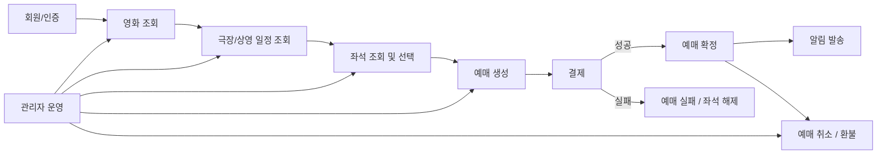

# 온라인 영화 예매 시스템

# 기능적 요구사항 요약

온라인 영화 예매 시스템의 기능적 요구사항은 크게 **9개 영역**으로 구분할 수 있다.

---

## 1. 회원 및 인증

사용자와 관리자의 신원을 확인하고, 권한에 따라 시스템 접근을 제어하는 기능이다.

* 회원가입, 로그인, 로그아웃
* 인증 토큰 발급
* 비밀번호 변경
* 일반 사용자와 관리자 권한 구분
* 인증된 사용자만 예매·결제·취소 기능 사용 가능
* 관리자 전용 기능 접근 제어

---

## 2. 영화 정보 조회

고객이 예매할 영화를 탐색하고 상세 정보를 확인할 수 있도록 하는 기능이다.

* 현재 상영작 및 개봉 예정작 조회
* 영화 제목, 장르, 관람 등급, 러닝타임, 줄거리, 포스터 조회
* 영화 제목 또는 장르 기반 검색
* 영화별 예매 가능한 상영 일정 조회
* 관리자의 영화 정보 등록·수정·비활성화

---

## 3. 극장 및 상영 일정 조회

사용자가 원하는 극장과 상영 회차를 선택할 수 있도록 지원하는 기능이다.

* 지역별 극장 목록 조회
* 극장별 상영관 정보 조회
* 영화별 날짜·극장·시간 기준 상영 일정 조회
* 특정 극장에서 상영 중인 영화 조회
* 이미 시작된 상영 회차의 신규 예매 제한
* 관리자의 극장·상영관·상영 일정 관리

---

## 4. 좌석 조회 및 선택

예매 과정에서 가장 중요한 실시간 좌석 상태를 관리하는 기능이다.

* 상영 회차별 전체 좌석 배치 및 상태 조회
* 좌석 상태 구분

  * 예매 가능
  * 임시 점유
  * 판매 완료
  * 사용 불가
* 사용자의 좌석 선택
* 판매 완료 좌석 선택 방지
* 결제 전 좌석 임시 점유
* 임시 점유 만료 시 자동 해제
* 동일 좌석의 중복 점유 방지
* 예매 확정 시 판매 완료 상태 전환
* 결제 실패 시 좌석 점유 해제

---

## 5. 예매 생성 및 관리

사용자가 선택한 영화·상영 일정·좌석을 실제 예매 건으로 생성하고 관리하는 기능이다.

* 예매 요청 생성
* 좌석 점유 상태 검증
* 결제 전 `결제 대기` 상태 관리
* 결제 성공 시 `예매 확정`
* 결제 실패 시 `예매 실패` 또는 `만료`
* 사용자별 예매 내역 조회
* 예매 번호 발급
* 동일 결제 요청에 대한 중복 예매 방지

---

## 6. 결제 처리

예매 건과 연결된 결제 요청을 생성하고, 외부 PG 결과를 반영하는 기능이다.

* 예매 건 기준 결제 요청 생성
* 외부 PG사 결제 승인 요청
* 결제 성공·실패·취소 결과 저장
* 결제 성공 시 예매 확정 처리 연계
* 결제 실패 시 예매 실패 및 좌석 해제 연계
* 중복 결제 방지
* 거래 식별자 관리
* PG 응답 지연 또는 오류 시 재확인·보상 처리 가능

---

## 7. 예매 취소 및 환불

예매 이후 고객이 취소를 요청했을 때 이를 검증하고 환불까지 연계하는 기능이다.

* 취소 가능 기한 내 예매 취소
* 취소 가능 여부 검증
* 환불 요청 생성
* 외부 PG사 환불 요청
* 환불 성공 시 `취소 완료` 처리
* 환불 실패 상태 별도 관리
* 취소된 좌석을 다시 예매 가능 상태로 복원
* 사용자별 취소 및 환불 상태 조회

---

## 8. 알림

예매와 결제, 취소 및 환불 결과를 사용자에게 전달하는 기능이다.

* 예매 완료 알림
* 결제 실패 알림
* 취소 완료 알림
* 환불 완료 알림
* 알림 발송 실패 이력 기록
* SMS, 이메일, 앱 푸시 등 채널 확장 가능

---

## 9. 관리자 운영 기능

운영자가 영화 예매 서비스를 유지·관리하기 위한 기능이다.

* 영화 정보 관리
* 극장 및 상영관 정보 관리
* 상영 일정 등록·수정·취소
* 상영 회차별 좌석 판매 현황 조회
* 전체 예매 현황 조회
* 취소 및 환불 처리 현황 조회
* 이상 결제 및 예매 오류 건 조회
* 주요 운영 로그 및 업무 이력 확인

---

# 기능적 요구사항 핵심 구조 요약

---

## 한 문장 요약

**온라인 영화 예매 시스템의 기능적 요구사항은 사용자가 영화를 탐색하고, 상영 회차와 좌석을 선택하여 결제 후 예매를 확정하고, 필요 시 취소·환불까지 처리할 수 있도록 지원하며, 관리자는 전체 영화·극장·상영·예매 운영을 통제할 수 있도록 구성된다.**
