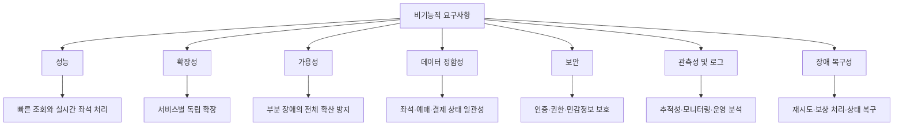

# 온라인 영화 예매 시스템

# 비기능적 요구사항 요약

온라인 영화 예매 시스템의 비기능적 요구사항은 크게 **7개 영역**으로 정리할 수 있다.

---

## 1. 응답 속도 및 성능

사용자가 영화 조회부터 좌석 선택, 결제까지 빠르게 진행할 수 있도록 주요 기능의 처리 속도를 보장해야 한다.

* 영화 목록 조회와 상영 일정 조회는 **2초 이내 응답**을 목표로 한다.
* 좌석 현황 조회는 **1초 이내 응답**을 목표로 한다.
* 좌석 임시 점유 요청은 경쟁 상황에서도 지연을 최소화해야 한다.
* 결제 승인 후 예매 확정 상태는 신속하게 반영되어야 한다.
* 관리자 조회 기능도 운영에 불편이 없도록 적절한 응답 속도를 보장해야 한다.

---

## 2. 확장성

특정 영화 개봉일이나 주말처럼 이용자가 급증하는 상황에도 안정적으로 처리할 수 있어야 한다.

* 조회 트래픽이 많은 영화·상영 일정·좌석 조회 기능은 독립적으로 확장 가능해야 한다.
* 예매, 결제, 알림 기능도 서비스별로 개별 확장 가능해야 한다.
* 트래픽 증가 시 서버를 수평 확장할 수 있어야 한다.
* 신규 결제 방식, 알림 채널, 외부 영화 정보 제공자 추가에 유연해야 한다.

---

## 3. 가용성

일부 기능에 장애가 발생하더라도 전체 예매 서비스가 중단되지 않도록 해야 한다.

* 핵심 조회 기능과 예매 기능은 높은 가용성을 유지해야 한다.
* 알림 서비스 장애가 예매 완료 자체를 막아서는 안 된다.
* 외부 결제 시스템 응답이 지연되어도 결제 상태를 추적할 수 있어야 한다.
* 특정 서비스 장애가 전체 시스템 장애로 확산되지 않도록 해야 한다.
* 장애 발생 시 운영자가 원인을 추적할 수 있는 기록이 남아야 한다.

---

## 4. 데이터 정합성

영화 예매 시스템의 핵심 품질 요소로, 좌석·예매·결제 상태 간 불일치를 방지해야 한다.

* 동일 좌석이 두 명 이상에게 중복 판매되어서는 안 된다.
* 예매 상태, 결제 상태, 좌석 상태는 일관성 있게 관리되어야 한다.
* 결제 성공 후 예매 확정이 누락되어서는 안 된다.
* 결제 실패나 취소 시 좌석 해제가 정확히 수행되어야 한다.
* 이벤트 중복 처리에도 결과가 변하지 않도록 **멱등성**을 고려해야 한다.
* 분산 환경에서 일부 서비스만 실패하는 상황을 보상 처리할 수 있어야 한다.

---

## 5. 보안

사용자 정보와 결제 정보를 보호하고, 권한 없는 접근을 차단해야 한다.

* 비밀번호는 안전하게 저장되어야 하며 평문 저장을 허용하지 않는다.
* 인증이 필요한 기능은 토큰 기반 접근 검증이 필요하다.
* 관리자 기능은 권한 검증 후 접근을 허용해야 한다.
* 결제 관련 민감 정보는 안전하게 처리되어야 한다.
* 주요 사용자 행위와 관리자 행위는 추적 가능해야 한다.
* 반복 로그인 실패, 비정상 예매 시도 등 이상 행위를 탐지할 수 있어야 한다.
* 외부 시스템과의 통신은 암호화 채널을 사용해야 한다.

---

## 6. 관측성 및 로그

시스템 상태를 모니터링하고 장애 원인을 분석할 수 있어야 한다.

* 요청 단위 추적을 위한 식별자가 필요하다.
* 예매 생성, 좌석 점유, 결제 요청, 환불 처리 등 핵심 업무 이벤트를 로그로 기록해야 한다.
* 오류 발생 시 원인 분석이 가능한 에러 로그를 남겨야 한다.
* 서비스별 응답 시간, 실패율 등 주요 지표를 수집할 수 있어야 한다.
* 이벤트 발행 실패, 외부 PG 연동 실패, 알림 발송 실패도 추적 가능해야 한다.

---

## 7. 장애 복구 및 회복성

실패한 업무 흐름을 안전하게 복구하고 정상 상태로 되돌릴 수 있어야 한다.

* 결제 성공 후 예매 확정 처리 실패 시 재처리 가능해야 한다.
* 알림 발송 실패 시 재시도하거나 실패 이력을 관리해야 한다.
* 좌석 임시 점유는 만료 시 자동 해제되어야 한다.
* 외부 시스템 장애로 중단된 처리 흐름도 상태 기반으로 복구할 수 있어야 한다.
* 예매, 결제, 환불과 같은 핵심 프로세스는 장애 후에도 이어서 처리 가능해야 한다.

---

# 비기능적 요구사항 핵심 구조 요약

---

## 한 문장 요약

**온라인 영화 예매 시스템의 비기능적 요구사항은 빠른 응답 속도, 트래픽 증가 대응, 높은 가용성, 좌석·예매·결제 데이터 정합성, 보안성, 운영 관측성, 장애 복구성을 중심으로 정의된다.**
