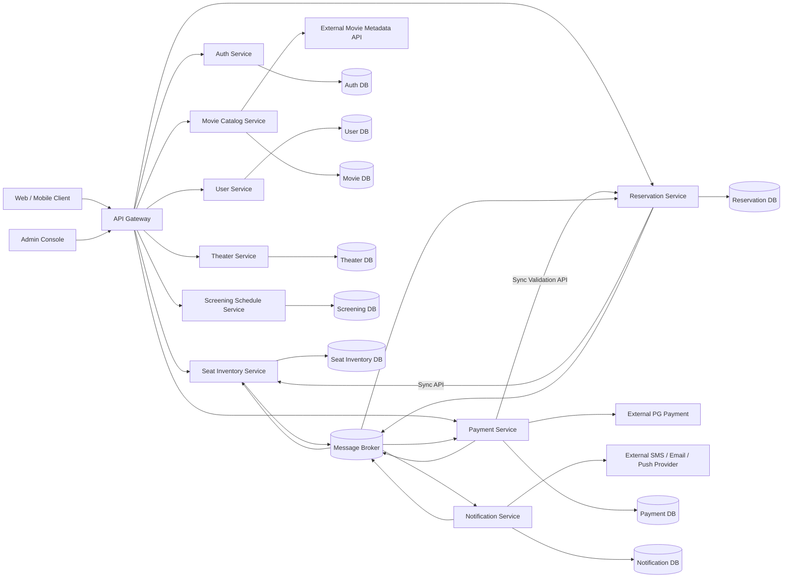
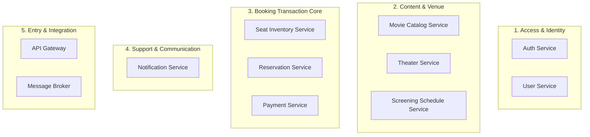
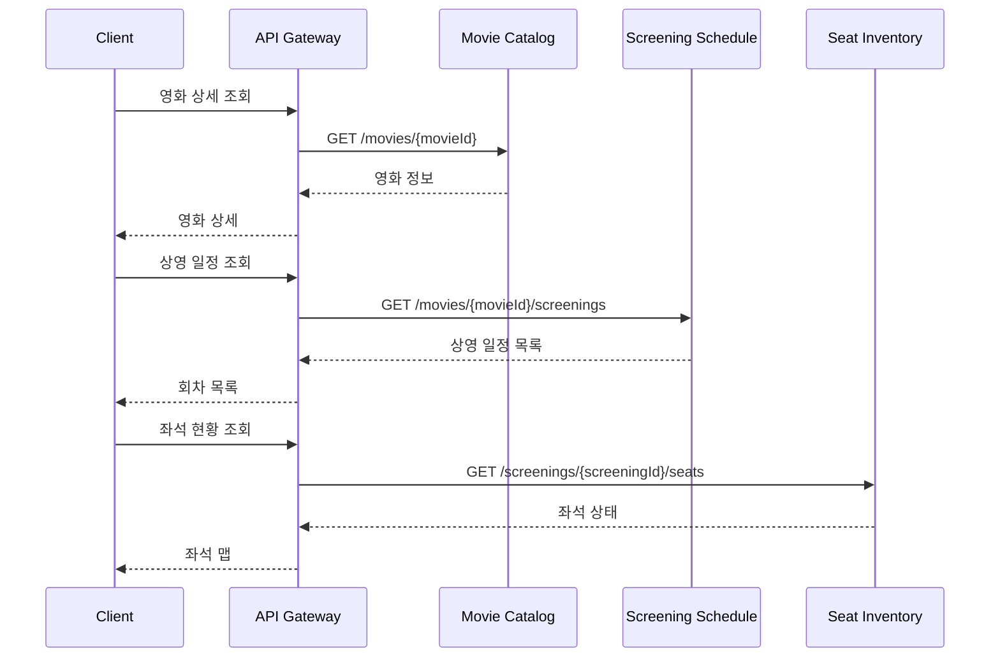
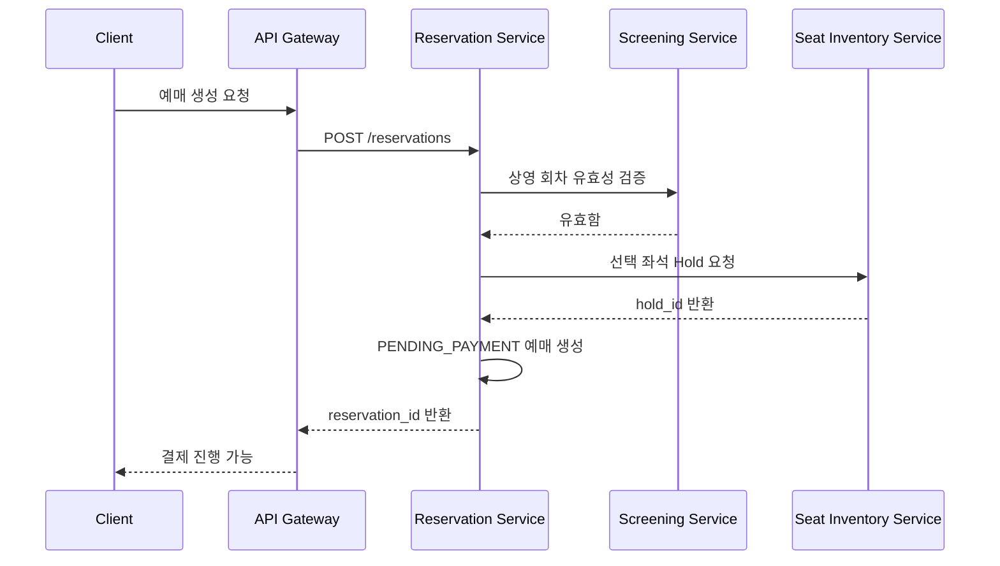
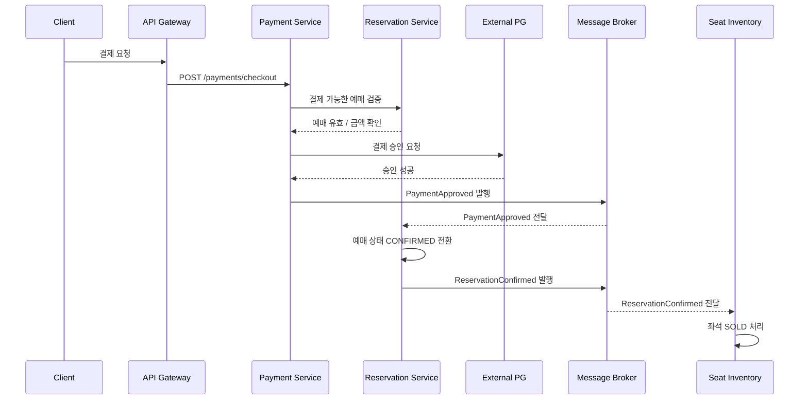
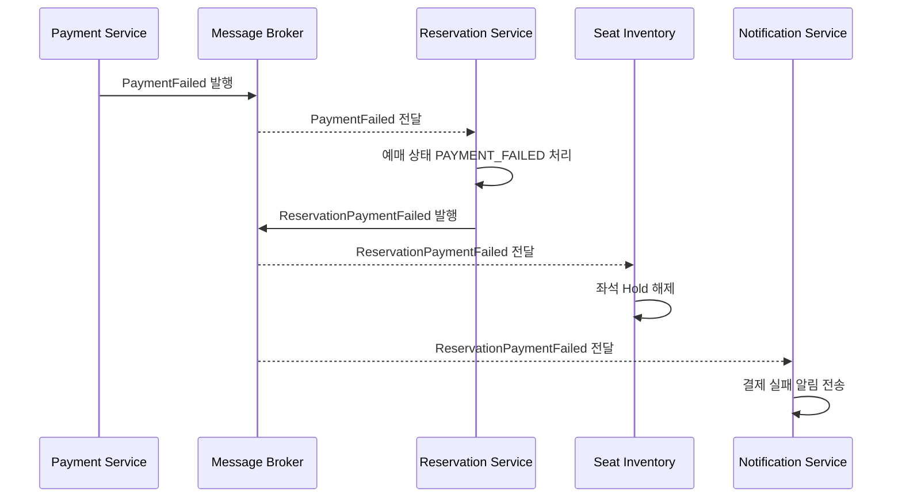
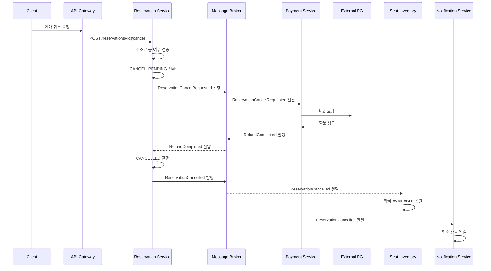

# 온라인 영화 예매 시스템

# 1단계. MSA 기본 설계서

---

# 1. 설계 개요

## 1.1 설계 목적

본 문서는 앞서 정의한 **온라인 영화 예매 시스템 SRS**를 기반으로,
향후

1. **함수 Signature 설계**
2. **Code Skeleton 작성**

단계로 이어질 수 있도록 **MSA 기본 설계**를 수립하는 것을 목적으로 한다.

이번 단계에서는 특히 다음을 중점적으로 설계한다.

* 서비스의 **책임 경계(Boundary)** 를 명확히 구분
* 각 서비스의 **데이터 소유권(Data Ownership)** 을 독립적으로 정의
* **동기 REST 호출**과 **비동기 이벤트 통신**을 구분
* **좌석·예매·결제**와 같은 고경합·고정합성 도메인을 분리
* 이후 함수 설계가 가능한 수준까지 핵심 컴포넌트와 인터페이스 구조를 정리

---

# 2. 설계 목표 및 핵심 원칙

## 2.1 설계 목표

| 목표         | 설명                                        |
| ---------- | ----------------------------------------- |
| 서비스 독립성 확보 | 각 서비스는 자신의 도메인 책임과 데이터만 소유                |
| 책임 경계 명확화  | “누가 무엇을 최종 책임지는가”를 분명히 정의                 |
| 결합도 최소화    | 서비스 간 직접 DB 접근 금지, API/Event 기반 연계        |
| 데이터 정합성 보장 | 좌석 중복 판매, 결제-예매 불일치 방지                    |
| 장애 격리      | 알림, 외부 PG 장애가 전체 시스템 장애로 확산되지 않도록 설계      |
| 확장성 확보     | 조회형 서비스와 거래형 서비스를 독립적으로 확장                |
| 후속 개발 연결성  | Signature와 Code Skeleton으로 자연스럽게 이어지도록 구성 |

---

## 2.2 핵심 설계 원칙

### 원칙 1. Database per Service

각 서비스는 **자신만의 데이터 저장소**를 가진다.

* Reservation Service가 Seat DB를 직접 읽거나 수정하지 않는다.
* Payment Service가 Reservation DB를 직접 갱신하지 않는다.
* 필요한 상호작용은 API 또는 이벤트를 통해 수행한다.

---

### 원칙 2. 업무 상태의 소유자는 하나만 둔다

중요 상태는 반드시 **단일 서비스가 최종 권위(Source of Truth)** 를 가진다.

| 상태        | 최종 소유 서비스                  |
| --------- | -------------------------- |
| 사용자 인증 상태 | Auth Service               |
| 사용자 프로필   | User Service               |
| 영화 기본정보   | Movie Catalog Service      |
| 극장/상영관 구조 | Theater Service            |
| 상영 일정     | Screening Schedule Service |
| 회차별 좌석 상태 | Seat Inventory Service     |
| 예매 상태     | Reservation Service        |
| 결제/환불 상태  | Payment Service            |
| 알림 발송 상태  | Notification Service       |

---

### 원칙 3. 동기 호출은 최소화하고, 상태 전파는 이벤트 중심으로 처리

* **즉시 응답이 필요한 조회·검증**은 REST API
* **상태 변화 전파**는 Message Broker 기반 Event

예:

* “좌석을 잡을 수 있는가?” → 동기 API
* “결제가 승인되었다” → 비동기 이벤트
* “예매가 확정되었다” → 비동기 이벤트
* “알림을 보내라” → 비동기 이벤트

---

### 원칙 4. 예매·좌석·결제를 하나의 서비스로 합치지 않는다

세 도메인은 서로 밀접하지만 책임은 다르다.

| 도메인            | 핵심 책임                 |
| -------------- | --------------------- |
| Seat Inventory | 특정 회차의 좌석이 잡혔는가, 팔렸는가 |
| Reservation    | 고객의 예매 건이 어떤 상태인가     |
| Payment        | 돈이 승인되었는가, 환불되었는가     |

따라서 각각 별도 서비스로 분리한다.

---

### 원칙 5. 취소와 환불은 같은 기능처럼 보이지만 소유 도메인이 다르다

* **예매 취소 요청 및 취소 상태** → Reservation Service
* **실제 금액 환불 처리** → Payment Service

따라서 본 기본 설계에서는
**별도 Cancellation/Refund Service를 두지 않고**,
Reservation과 Payment 사이의 **협업 프로세스**로 설계한다.

> 추후 부분 환불, 위약금 정책, 정산, 수동 환불 운영이 복잡해지면
> `Refund Service` 또는 `Settlement Service` 분리를 검토할 수 있다.

---

# 3. 전체 시스템 구성

## 3.1 권장 MSA 전체 구조



---

# 4. 최종 권장 서비스 구조

## 4.1 서비스 클러스터 관점



---

## 4.2 최종 권장 서비스 목록

| 구분          | 서비스                                                                |
| ----------- | ------------------------------------------------------------------ |
| 진입 계층       | API Gateway                                                        |
| 인증/회원       | Auth Service, User Service                                         |
| 콘텐츠/운영 기준정보 | Movie Catalog Service, Theater Service, Screening Schedule Service |
| 핵심 거래       | Seat Inventory Service, Reservation Service, Payment Service       |
| 후행 처리       | Notification Service                                               |
| 비동기 통신      | Message Broker                                                     |
| 외부 연계       | PG, 알림 제공자, 영화 메타데이터 API                                           |

---

# 5. 서비스 경계 설계 핵심 결정

---

## 5.1 Auth Service와 User Service 분리

### 분리 이유

인증 정보와 사용자 프로필은 성격이 다르다.

| 항목     | Auth Service                     | User Service          |
| ------ | -------------------------------- | --------------------- |
| 관심사    | 인증, 권한, 토큰                       | 사용자 정보, 연락처, 선호정보     |
| 주요 데이터 | 계정, 패스워드 해시, Refresh Token, Role | 이름, 전화번호, 이메일 수신 동의 등 |
| 보안 민감도 | 매우 높음                            | 높음                    |
| 확장 방향  | SSO, OAuth, MFA                  | 마이페이지, 회원등급, 선호극장     |

### 경계

* Auth Service는 **프로필 상세정보를 관리하지 않는다.**
* User Service는 **비밀번호와 인증 토큰을 관리하지 않는다.**

---

## 5.2 Movie / Theater / Screening 분리

### 분리 이유

영화 콘텐츠, 물리 공간, 상영 회차는 서로 다른 생명주기를 가진다.

| 서비스                        | 관리 대상                    |
| -------------------------- | ------------------------ |
| Movie Catalog Service      | 영화 자체                    |
| Theater Service            | 극장, 상영관, 좌석 배치 템플릿       |
| Screening Schedule Service | 특정 영화가 언제 어느 상영관에서 상영되는가 |

### 경계

* Movie Service는 **상영 시간을 관리하지 않는다.**
* Theater Service는 **회차별 상영 일정을 관리하지 않는다.**
* Screening Service는 **좌석 판매 상태를 관리하지 않는다.**

---

## 5.3 Screening Schedule Service와 Seat Inventory Service 분리

### 분리 이유

상영 회차 생성과 좌석 판매 상태 관리는 성격이 다르다.

| 항목    | Screening Schedule    | Seat Inventory              |
| ----- | --------------------- | --------------------------- |
| 책임    | 상영 회차 정의              | 해당 회차의 좌석 상태                |
| 데이터   | 시작 시각, 종료 시각, 상영관, 영화 | 좌석별 AVAILABLE / HELD / SOLD |
| 변경 빈도 | 운영자가 등록/수정            | 실시간 사용자 트래픽으로 초당 다수 변경      |
| 확장성   | 조회 중심                 | 고경합 트랜잭션 중심                 |

### 경계

* Screening Service는 좌석이 팔렸는지 모른다.
* Seat Inventory Service는 회차의 영화 제목을 책임지지 않는다.
* Seat Inventory는 `screening_id`를 기준으로 좌석 상태만 관리한다.

---

## 5.4 Seat Inventory Service와 Reservation Service 분리

### 분리 이유

좌석 점유와 예매 건의 생성은 같은 일이 아니다.

| 항목      | Seat Inventory Service         | Reservation Service                                                    |
| ------- | ------------------------------ | ---------------------------------------------------------------------- |
| 핵심 질문   | 이 좌석을 잡을 수 있는가?                | 이 고객의 예매 상태는 무엇인가?                                                     |
| 상태      | AVAILABLE, HELD, SOLD, BLOCKED | PENDING_PAYMENT, CONFIRMED, FAILED, EXPIRED, CANCEL_PENDING, CANCELLED |
| 정합성 포인트 | 중복 점유/중복 판매 방지                 | 예매 상태 전이 일관성                                                           |
| 주요 액션   | hold, release, confirm sold    | create reservation, confirm, expire, cancel                            |

### 경계

* Reservation Service는 Seat DB를 직접 수정하지 않는다.
* Seat Inventory Service는 예매 가격, 결제 상태를 알지 않는다.
* Seat Inventory는 Reservation ID를 참고값으로 둘 수는 있지만, 예매 비즈니스 규칙은 갖지 않는다.

---

## 5.5 Reservation Service와 Payment Service 분리

### 분리 이유

예매 상태와 결제 상태는 서로 다른 비즈니스 트랜잭션이다.

| 항목      | Reservation Service | Payment Service |
| ------- | ------------------- | --------------- |
| 책임      | 예매 건 상태관리           | 결제·환불 거래관리      |
| 상태      | 예매 대기/확정/실패/취소      | 결제 요청/승인/실패/환불  |
| 외부 연동   | 없음                  | PG 연동           |
| 데이터 민감도 | 일반 거래 정보            | 금융 거래 정보        |

### 경계

* Reservation Service는 PG와 직접 통신하지 않는다.
* Payment Service는 예매 확정 상태를 직접 수정하지 않는다.
* Payment가 승인되면 `PaymentApproved` 이벤트를 발행한다.
* Reservation이 이를 소비하여 예매 확정 여부를 결정한다.

---

## 5.6 Notification Service는 후행 처리 전용으로 분리

### 분리 이유

알림은 중요하지만 예매 확정의 핵심 트랜잭션은 아니다.

### 경계

* Notification Service 장애가 Reservation 실패로 이어지지 않아야 한다.
* 알림 서비스는 예매나 결제의 진실값을 판단하지 않는다.
* `ReservationConfirmed`, `RefundCompleted` 같은 이벤트를 받아 발송만 수행한다.

---

# 6. 서비스별 책임 경계 상세

---

## 6.1 API Gateway

### 핵심 책임

* 외부 클라이언트 단일 진입점
* 라우팅
* 인증 토큰 1차 검증
* Rate Limit
* 요청 로깅
* 공통 에러 응답 포맷

### 포함 기능

* `/auth/*`
* `/movies/*`
* `/theaters/*`
* `/screenings/*`
* `/seats/*`
* `/reservations/*`
* `/payments/*`

### 소유 데이터

* 일반적으로 비즈니스 데이터 없음
* 라우팅 설정, Rate Limit 정책 정도만 관리 가능

### 하지 않는 일

* 예매 로직 수행 금지
* 결제 승인 처리 금지
* 서비스 간 업무 오케스트레이션을 과도하게 수행하지 않음

---

## 6.2 Auth Service

### 핵심 책임

* 회원 인증
* 로그인/로그아웃
* 토큰 발급 및 재발급
* 권한(Role) 관리

### 소유 데이터

* account_id
* login_id/email
* password_hash
* roles
* refresh_tokens
* login_attempts

### 제공 API 예시

* `POST /auth/signup`
* `POST /auth/login`
* `POST /auth/logout`
* `POST /auth/token/refresh`
* `GET /auth/me/claims`

### 발행 이벤트

* `AccountCreated`
* `AccountDisabled`

### 구독 이벤트

* 없음 또는 제한적

### 경계

* 프로필 관리 금지
* 예매 내역 관리 금지

---

## 6.3 User Service

### 핵심 책임

* 사용자 프로필 관리
* 연락처 및 알림 수신 정보
* 마이페이지 정보

### 소유 데이터

* user_id
* account_id
* display_name
* mobile_number
* notification_preferences
* favorite_theaters 등 확장 가능

### 제공 API 예시

* `GET /users/me`
* `PATCH /users/me`
* `GET /users/{userId}` 내부용 제한 API

### 발행 이벤트

* `UserProfileCreated`
* `UserProfileUpdated`

### 경계

* 인증 비밀번호 관리 금지
* 결제 수단 직접 관리 금지
* 예매 상태 직접 관리 금지

---

## 6.4 Movie Catalog Service

### 핵심 책임

* 영화 기본정보 관리
* 상영 중/예정 영화 목록 제공
* 외부 영화 메타데이터 연계

### 소유 데이터

* movie_id
* title
* genre
* age_rating
* running_time
* synopsis
* poster_url
* release_status

### 제공 API 예시

* `GET /movies`
* `GET /movies/{movieId}`
* `GET /movies/search`
* `POST /admin/movies`
* `PATCH /admin/movies/{movieId}`

### 발행 이벤트

* `MovieCreated`
* `MovieUpdated`
* `MovieStatusChanged`

### 경계

* 극장/상영회차 관리 금지
* 좌석 상태 관리 금지

---

## 6.5 Theater Service

### 핵심 책임

* 극장 및 상영관 기준정보 관리
* 상영관 좌석 배치 템플릿 관리

### 소유 데이터

* theater_id
* theater_name
* region
* auditorium_id
* auditorium_name
* seat_layout_template

### 제공 API 예시

* `GET /theaters`
* `GET /theaters/{theaterId}`
* `GET /theaters/{theaterId}/auditoriums`
* `POST /admin/theaters`
* `POST /admin/auditoriums`

### 발행 이벤트

* `TheaterCreated`
* `AuditoriumCreated`
* `SeatLayoutTemplateUpdated`

### 경계

* 특정 날짜의 상영일정 관리 금지
* 회차별 좌석 판매 상태 관리 금지

---

## 6.6 Screening Schedule Service

### 핵심 책임

* 영화가 언제, 어디서 상영되는지 관리
* 상영 회차별 판매 가능 상태 관리

### 소유 데이터

* screening_id
* movie_id
* theater_id
* auditorium_id
* start_time
* end_time
* sales_status
* booking_open_at
* booking_close_at

### 제공 API 예시

* `GET /screenings`
* `GET /screenings/{screeningId}`
* `GET /movies/{movieId}/screenings`
* `GET /theaters/{theaterId}/screenings`
* `POST /admin/screenings`

### 발행 이벤트

* `ScreeningCreated`
* `ScreeningUpdated`
* `ScreeningSalesOpened`
* `ScreeningSalesClosed`
* `ScreeningCancelled`

### 구독 이벤트

* 필요 시 `MovieStatusChanged`, `AuditoriumUpdated`

### 경계

* 좌석 상태 저장 금지
* 예매 건 생성 금지
* 결제 상태 판단 금지

---

## 6.7 Seat Inventory Service

### 핵심 책임

* 회차별 좌석 상태 관리
* 좌석 임시 점유(Hold)
* Hold 만료 처리
* 예매 확정에 따른 좌석 SOLD 처리
* 실패/취소에 따른 좌석 복구

### 소유 데이터

* screening_id
* seat_id
* seat_status
* hold_id
* hold_expired_at
* reservation_reference

### 좌석 상태 예시

* `AVAILABLE`
* `HELD`
* `SOLD`
* `BLOCKED`

### 제공 API 예시

* `GET /screenings/{screeningId}/seats`
* `POST /seat-holds`
* `DELETE /seat-holds/{holdId}`

### 발행 이벤트

* `SeatHoldCreated`
* `SeatHoldRejected`
* `SeatHoldExpired`
* `SeatReleased`
* `SeatsMarkedSold`

### 구독 이벤트

* `ReservationConfirmed`
* `ReservationFailed`
* `ReservationExpired`
* `ReservationCancelled`

### 경계

* 예매 금액 계산 금지
* 사용자 정보 관리 금지
* PG 결제 판단 금지

---

## 6.8 Reservation Service

### 핵심 책임

* 예매 건 생성과 상태 전이
* 결제 대기 예매 관리
* 결제 성공 후 예매 확정
* 실패/만료 처리
* 취소 요청 수용 및 상태 관리

### 소유 데이터

* reservation_id
* user_id
* screening_id
* hold_id
* selected_seats
* total_amount_snapshot
* reservation_status
* created_at
* expires_at
* cancelled_at

### 예매 상태 예시

* `PENDING_PAYMENT`
* `CONFIRMED`
* `PAYMENT_FAILED`
* `EXPIRED`
* `CANCEL_PENDING`
* `CANCELLED`

### 제공 API 예시

* `POST /reservations`
* `GET /reservations/{reservationId}`
* `GET /users/me/reservations`
* `POST /reservations/{reservationId}/cancel`

### 동기 의존

* Seat Inventory Service: 좌석 Hold 생성
* Screening Schedule Service: 상영 회차 유효성 검증
* 필요 시 User Service: 회원 존재 확인

### 발행 이벤트

* `ReservationCreated`
* `ReservationPendingPayment`
* `ReservationConfirmed`
* `ReservationPaymentFailed`
* `ReservationExpired`
* `ReservationCancelRequested`
* `ReservationCancelled`

### 구독 이벤트

* `PaymentApproved`
* `PaymentFailed`
* `RefundCompleted`
* `RefundFailed`
* `SeatHoldExpired`

### 경계

* PG 직접 호출 금지
* 좌석 DB 직접 갱신 금지
* 알림 발송 직접 수행 금지

---

## 6.9 Payment Service

### 핵심 책임

* 결제 주문 생성
* 외부 PG 승인 요청
* 승인/실패 결과 수신
* 환불 요청 및 환불 상태 관리
* 중복 결제 방지
* 거래 식별자 관리

### 소유 데이터

* payment_id
* reservation_id
* order_id
* amount
* payment_status
* pg_transaction_id
* approved_at
* refund_id
* refund_status

### 결제 상태 예시

* `READY`
* `REQUESTED`
* `APPROVED`
* `FAILED`
* `CANCEL_REQUESTED`
* `REFUND_PENDING`
* `REFUNDED`
* `REFUND_FAILED`

### 제공 API 예시

* `POST /payments/checkout`
* `POST /payments/confirm`
* `GET /payments/{paymentId}`

### 동기 의존

* Reservation Service: 결제 가능 예매인지 검증, 금액 스냅샷 확인

### 외부 연계

* PG 결제 API
* PG 승인 콜백/Webhook

### 발행 이벤트

* `PaymentRequested`
* `PaymentApproved`
* `PaymentFailed`
* `RefundRequested`
* `RefundCompleted`
* `RefundFailed`

### 구독 이벤트

* `ReservationCancelRequested`

### 경계

* 예매 확정 직접 변경 금지
* 좌석 상태 직접 변경 금지
* 사용자 알림 직접 수행 금지

---

## 6.10 Notification Service

### 핵심 책임

* 알림 요청 수신
* 메시지 템플릿 적용
* SMS/Email/Push 전송
* 실패 재시도 및 발송 이력 기록

### 소유 데이터

* notification_id
* event_type
* recipient
* channel
* message_body
* delivery_status
* retry_count

### 구독 이벤트

* `ReservationConfirmed`
* `PaymentFailed`
* `ReservationCancelled`
* `RefundCompleted`
* `RefundFailed`

### 발행 이벤트

* `NotificationDelivered`
* `NotificationFailed`

### 경계

* 예매 상태 판단 금지
* 환불 성공 여부 자체를 결정하지 않음
* 비즈니스 트랜잭션 실패 원인이 되지 않음

---

# 7. 관리자 기능 설계 원칙

## 7.1 관리자 기능은 별도 핵심 도메인 서비스로 과도 분리하지 않는다

기본 설계에서는 `Admin Service`를 독립 비즈니스 도메인으로 두지 않고,
다음 구조를 권장한다.

```text
Admin Console
   ↓
API Gateway
   ↓
각 도메인 서비스의 관리자 전용 API
```

예:

| 관리자 기능      | 실제 소유 서비스                  |
| ----------- | -------------------------- |
| 영화 등록/수정    | Movie Catalog Service      |
| 극장/상영관 관리   | Theater Service            |
| 상영 일정 등록/수정 | Screening Schedule Service |
| 좌석 판매 현황    | Seat Inventory Service     |
| 예매 현황       | Reservation Service        |
| 결제/환불 현황    | Payment Service            |

---

## 7.2 별도 Operation Service 도입 가능 시점

다음이 복잡해질 경우 후속 분리를 검토한다.

* 운영자 권한 체계가 세분화
* 정산/매출/대시보드 요구가 커짐
* 수동 환불, 수동 좌석 복구 등 운영 워크플로가 증가
* 관리자 승인 절차가 생김

그 경우

* `Admin Operation Service`
* `Audit Service`
* `Reporting Service`

분리가 가능하다.

---

# 8. 서비스별 데이터 소유권

| 서비스                        | 최종 소유 데이터            |
| -------------------------- | -------------------- |
| Auth Service               | 계정, 자격증명, 권한, 토큰     |
| User Service               | 사용자 프로필, 연락처, 알림 선호  |
| Movie Catalog Service      | 영화 정보                |
| Theater Service            | 극장, 상영관, 좌석 레이아웃 템플릿 |
| Screening Schedule Service | 상영 회차, 판매 가능 시간      |
| Seat Inventory Service     | 회차별 좌석 상태, Hold      |
| Reservation Service        | 예매 건, 예매 상태, 취소 상태   |
| Payment Service            | 결제 요청, 승인 결과, 환불 상태  |
| Notification Service       | 알림 요청, 발송 상태         |

---

## 8.1 복제 허용 데이터와 금지 데이터

MSA 환경에서 조회 성능을 위해 일부 스냅샷은 복제 가능하다.

| 복제 데이터                                | 허용 여부 | 비고                 |
| ------------------------------------- | ----- | ------------------ |
| Reservation에 movie_title snapshot 저장  | 허용 가능 | 예매 당시 표시용          |
| Reservation에 theater_name snapshot 저장 | 허용 가능 | 예매내역 안정성           |
| Payment에 reservation_id, amount 저장    | 허용    | 거래 추적용             |
| Seat Inventory에 사용자 프로필 저장            | 금지    | 도메인 경계 위반          |
| Reservation이 Payment 내부 상태 테이블 복제     | 금지    | Payment 이벤트 결과만 반영 |
| Payment가 Reservation 상태 직접 수정         | 금지    | API/Event 사용       |

---

# 9. 서비스 간 통신 구조

---

## 9.1 동기 REST 호출 사용 기준

즉시 응답이 필요한 경우에만 사용한다.

| 호출 주체       | 대상 서비스      | 목적           |
| ----------- | ----------- | ------------ |
| Gateway     | Movie       | 영화 조회        |
| Gateway     | Screening   | 상영 일정 조회     |
| Gateway     | Seat        | 좌석 현황 조회     |
| Reservation | Screening   | 상영 회차 유효성 검증 |
| Reservation | Seat        | 좌석 Hold 생성   |
| Payment     | Reservation | 결제 대상 예약 검증  |
| Gateway     | Payment     | 결제 세션 생성     |

---

## 9.2 비동기 이벤트 사용 기준

상태 변화와 후행 처리에는 이벤트를 사용한다.

| 이벤트                          | 발행 서비스         | 주요 소비 서비스                    |
| ---------------------------- | -------------- | ---------------------------- |
| `SeatHoldExpired`            | Seat Inventory | Reservation                  |
| `PaymentApproved`            | Payment        | Reservation                  |
| `PaymentFailed`              | Payment        | Reservation                  |
| `ReservationConfirmed`       | Reservation    | Seat Inventory, Notification |
| `ReservationPaymentFailed`   | Reservation    | Seat Inventory, Notification |
| `ReservationCancelRequested` | Reservation    | Payment                      |
| `RefundCompleted`            | Payment        | Reservation, Notification    |
| `RefundFailed`               | Payment        | Reservation, Notification    |
| `ReservationCancelled`       | Reservation    | Seat Inventory, Notification |

---

# 10. 핵심 업무 흐름 설계

---

## 10.1 상영 일정 및 좌석 조회 흐름



---

## 10.2 예매 생성 흐름

### 설계 원칙

예매 생성은 Reservation Service가 주도한다.
좌석 점유는 Seat Inventory Service가 수행한다.



---

## 10.3 결제 처리 흐름

### 핵심 원칙

* Payment Service는 결제만 책임진다.
* Reservation Service는 결제 결과를 받아 예매 확정을 책임진다.
* Seat Inventory는 예매 확정 이벤트를 받아 좌석을 SOLD 처리한다.



---

## 10.4 결제 실패 흐름



---

## 10.5 취소 및 환불 흐름



---

# 11. 데이터 정합성과 분산 트랜잭션 전략

---

## 11.1 핵심 정합성 요구사항

| 정합성 대상              | 설계 대응                                                  |
| ------------------- | ------------------------------------------------------ |
| 좌석 중복 판매 금지         | Seat Inventory가 원자적 Hold 처리                            |
| 결제 성공 후 예매 확정 누락 방지 | PaymentApproved 이벤트 재처리 가능                             |
| 좌석 Hold 만료          | SeatHoldExpired 이벤트 처리                                 |
| 예매 확정 후 좌석 SOLD 반영  | ReservationConfirmed 소비                                |
| 취소 후 환불-좌석 복구 순서    | RefundCompleted → ReservationCancelled → Seat Released |

---

## 11.2 Saga 패턴 적용

예매 완료는 하나의 로컬 트랜잭션이 아니라, 여러 서비스 상태 전이로 완성된다.

### 예매 Saga

```text
1. Reservation 생성
2. Seat Hold 성공
3. Payment 승인
4. Reservation Confirmed
5. Seat Sold 처리
6. Notification 전송
```

### 실패 시 보상 흐름

| 실패 지점           | 보상 처리              |
| --------------- | ------------------ |
| 좌석 Hold 실패      | 예매 생성 중단           |
| 결제 실패           | 예매 실패 처리 + Hold 해제 |
| 결제 성공 후 예매 만료   | 환불 보상 프로세스 필요      |
| Seat SOLD 처리 실패 | 이벤트 재시도 및 운영 알림    |
| 알림 실패           | 재시도, 예매 자체는 유지     |

---

## 11.3 이벤트 멱등성

각 이벤트 소비자는 중복 이벤트를 안전하게 처리해야 한다.

예:

* 동일 `PaymentApproved`를 두 번 받아도 예매가 두 번 확정되지 않아야 한다.
* 동일 `ReservationConfirmed`를 두 번 받아도 좌석이 중복 변경되지 않아야 한다.
* 동일 `RefundCompleted`를 두 번 받아도 취소가 중복 처리되지 않아야 한다.

이를 위해 각 서비스는 다음을 고려한다.

* `event_id`
* `aggregate_id`
* `processed_event_log`
* 상태 전이 검증
* Idempotency Key

---

# 12. 장애 대응 및 복구 전략

---

## 12.1 대표 장애 시나리오

| 장애                                     | 대응                                |
| -------------------------------------- | --------------------------------- |
| Payment 승인 후 Reservation 이벤트 처리 실패     | 이벤트 재전송 또는 재소비                    |
| ReservationConfirmed 후 Seat SOLD 처리 실패 | Seat 서비스 재처리 큐                    |
| Notification 서비스 장애                    | 예약 확정과 무관하게 알림만 재시도               |
| PG 응답 지연                               | Payment 상태를 PENDING 상태로 유지, 후속 조회 |
| Hold 만료 직전 결제 승인                       | Reservation 상태 검증 후 환불 보상 분기      |
| Message Broker 일시 장애                   | Outbox 패턴으로 이벤트 유실 방지             |

---

## 12.2 권장 기술 패턴

| 패턴                          | 적용 목적                  |
| --------------------------- | ---------------------- |
| Transactional Outbox        | DB 커밋과 이벤트 발행 간 불일치 방지 |
| Inbox / Processed Event Log | 중복 이벤트 처리 방지           |
| Retry + DLQ                 | 일시 장애 재시도와 최종 실패 격리    |
| Circuit Breaker             | 외부 PG 및 외부 알림 장애 전파 차단 |
| Timeout                     | 장시간 대기 방지              |
| State Machine               | 예매/결제/환불 상태 전이 일관성 확보  |

---

# 13. 보안 및 권한 설계

---

## 13.1 인증/인가 구조

```text
Client
  → API Gateway
    → Access Token 검증
      → 각 서비스별 권한 재검증
```

---

## 13.2 권한 분리

| 기능        | 권한         |
| --------- | ---------- |
| 영화 조회     | 비로그인 허용    |
| 좌석 조회     | 비로그인 허용 가능 |
| 예매 생성     | 로그인 필요     |
| 결제        | 로그인 필요     |
| 예매 취소     | 본인만 가능     |
| 관리자 영화 등록 | 관리자 권한     |
| 상영 일정 관리  | 관리자 권한     |
| 운영 현황 조회  | 관리자 권한     |

---

# 14. 운영 및 확장성 설계

---

## 14.1 확장 우선순위

| 트래픽 특성         | 우선 확장 대상                          |
| -------------- | --------------------------------- |
| 영화/상영 일정 조회 증가 | Movie, Screening                  |
| 좌석 조회 급증       | Seat Inventory 조회 Replica / Cache |
| 예매 몰림          | Reservation, Seat Inventory       |
| 결제 집중          | Payment                           |
| 알림 대량          | Notification Worker               |

---

## 14.2 캐시 적용 후보

| 대상    | 적용 가능성         |
| ----- | -------------- |
| 영화 목록 | 높음             |
| 영화 상세 | 높음             |
| 극장 목록 | 높음             |
| 상영 일정 | 중간             |
| 좌석 상태 | 제한적, 짧은 TTL 필요 |
| 예매 상태 | 제한적            |

---

## 14.3 관측성

서비스별로 다음을 수집한다.

* API 응답 시간
* 에러율
* 결제 실패율
* 좌석 Hold 실패율
* 좌석 Hold 만료율
* 예매 확정 지연 시간
* 환불 실패율
* 알림 재시도율

---

# 15. Function Signature 설계로 이어질 기준

다음 단계의 함수 Signature 설계에서는 아래 기준을 기반으로 진행한다.

---

## 15.1 서비스별 주요 Application Use Case 후보

| 서비스            | 주요 Use Case                                                                   |
| -------------- | ----------------------------------------------------------------------------- |
| Auth           | register_account, login, refresh_token                                        |
| User           | get_my_profile, update_my_profile                                             |
| Movie          | list_movies, get_movie_detail, create_movie                                   |
| Theater        | list_theaters, get_auditoriums                                                |
| Screening      | list_screenings, create_screening                                             |
| Seat Inventory | get_seat_map, create_seat_hold, expire_hold, mark_seats_sold                  |
| Reservation    | create_reservation, confirm_reservation, fail_reservation, cancel_reservation |
| Payment        | create_checkout, approve_payment, fail_payment, request_refund                |
| Notification   | send_reservation_confirmed_notice, send_refund_notice                         |

---

## 15.2 이후 Signature 설계 시 명확히 해야 할 항목

각 함수별로 다음을 정의한다.

* 함수명
* 입력 DTO
* 출력 DTO
* 예외 유형
* 수행 책임
* 외부 서비스 호출 여부
* 발행 이벤트 여부
* 트랜잭션 경계
* 멱등성 여부

---

# 16. Coding Agent 전달 요약

## 16.1 기본 설계의 최종 핵심

```text
영화 예매 시스템의 MSA 핵심은
"좌석 상태", "예매 상태", "결제 상태"를
각기 다른 서비스가 책임지도록 분리하는 것이다.
```

---

## 16.2 설계 결정 요약

| 설계 이슈                     | 결정                                          |
| ------------------------- | ------------------------------------------- |
| Auth와 User                | 분리                                          |
| Movie, Theater, Screening | 분리                                          |
| Screening과 Seat Inventory | 분리                                          |
| Seat와 Reservation         | 분리                                          |
| Reservation과 Payment      | 분리                                          |
| Notification              | 독립 후행 처리                                    |
| Cancellation/Refund       | 별도 서비스 아님. Reservation + Payment 협업         |
| Admin                     | 각 도메인 서비스의 관리자 API 중심, 전용 Admin Service는 보류 |
| 상태 전파                     | 이벤트 중심                                      |
| DB                        | 서비스별 독립 소유                                  |
| 트랜잭션                      | Saga + 보상 처리                                |

---

# 최종 결론

‘온라인 영화 예매 시스템’의 MSA 기본 설계는 다음 구조를 최종 권장한다.

```text
[Access]
- API Gateway
- Auth Service
- User Service

[Catalog & Venue]
- Movie Catalog Service
- Theater Service
- Screening Schedule Service

[Booking Transaction Core]
- Seat Inventory Service
- Reservation Service
- Payment Service

[Support]
- Notification Service

[Integration]
- Message Broker
- External PG
- External Notification Provider
- External Movie Metadata API
```

이 구조는 다음을 만족한다.

* 서비스 책임 경계가 명확하다.
* 데이터 소유권이 충돌하지 않는다.
* 예매·좌석·결제의 핵심 거래 흐름을 안정적으로 분리한다.
* 향후 **Function Signature 설계**와 **Code Skeleton 작성**으로 직접 이어질 수 있다.
